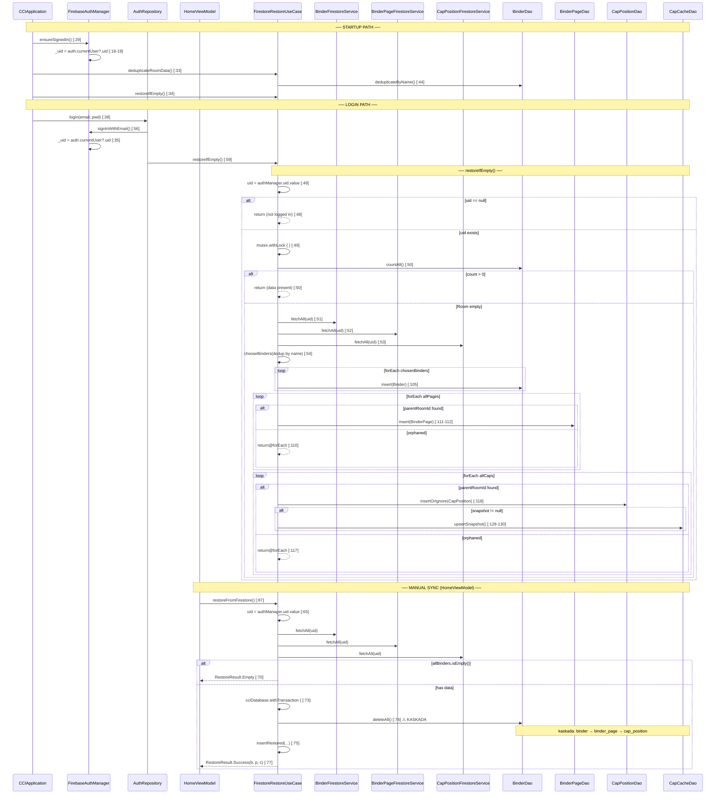

# Research: FirestoreRestoreUseCase — flow restore kolekcji

## Research Question

Przeanalizuj przepływ restore kolekcji (FirestoreRestoreUseCase), zwracając szczególną uwagę na: (1) pełną ścieżkę e2e z file:line, (2) luki w testach, (3) blast radius przy zmianie przepływu. Oddziel evidence od inference od unknown.

---

## 1. Feature Overview

### Czym jest ten flow

FirestoreRestoreUseCase to jedyna operacja w systemie, która może **wyzerować i odbudować całą lokalną bazę Room** na podstawie danych z Firestore. Składa się z dwóch metod o różnej semantyce:

| Metoda | Semantyka | Kto wywołuje |
|--------|-----------|--------------|
| `restoreIfEmpty()` | Lazy guard: pobierz z Firestore TYLKO jeśli Room jest pusty | `CCIApplication:34`, `AuthRepository:59` |
| `restoreFromFirestore()` | Destruktywna: `deleteAll()` + kaskada + re-insert z Firestore | `HomeViewModel:87` (manual sync) |
| `deduplicateRoomData()` | Offline recovery: usuń duplikaty binderów po nazwie | `CCIApplication:33` (tylko startup) |

**EVIDENCE**: ast-grep po `firestoreRestoreUseCase.$METHOD($$$)` w `app/src/main/` zwraca **4 call-sites** (metodowe wywołania) w 3 plikach produkcyjnych. Liczba "7" mylnie liczyła razem wywołania (4) + deklaracje pól inject/constructor (3: `CCIApplication:20`, `AuthRepository:22`, `HomeViewModel:40`).

**DISCOVERY vs repo-map**: Mapa wskazała 2 miejsca wywołania (CCIApplication + AuthRepository). Sub-agent 3 znalazł **trzecie**: `HomeViewModel:87` — ręczna synchronizacja przez użytkownika. To był `unknown` w mapie.

---

### Entry pointy i sekwencja (EVIDENCE — przeczytane pliki)

#### Startup path: CCIApplication.onCreate()

```
CCIApplication.kt:29  applicationScope.launch {
CCIApplication.kt:29    firebaseAuthManager.ensureSignedIn()
  FirebaseAuthManager.kt:18-19  if (auth.currentUser != null) _uid.value = uid

CCIApplication.kt:30-32  uid?.let { Sentry.setUser(...) }

CCIApplication.kt:33  firestoreRestoreUseCase.deduplicateRoomData()
  FirestoreRestoreUseCase.kt:44  binderDao.deduplicateByName()
    BinderDao.kt:31-32  DELETE duplikaty, zostaw MAX(id) per name

CCIApplication.kt:34  firestoreRestoreUseCase.restoreIfEmpty()
  → patrz sekwencja restoreIfEmpty() poniżej
```

#### Login path: AuthRepository.login()

```
AuthRepository.kt:38  suspend fun login(email, password)
AuthRepository.kt:41    authApiService.login(...)
AuthRepository.kt:45-71  when (response.code()) {
  200, 302 →
    AuthRepository.kt:56  firebaseAuthManager.signInWithEmail(email, password)
      FirebaseAuthManager.kt:26-28  if (current != null && !isAnonymous) return  ← już zalogowany
      FirebaseAuthManager.kt:31    auth.signInWithEmailAndPassword().await()
      FirebaseAuthManager.kt:33    catch → auth.createUserWithEmailAndPassword().await()
      FirebaseAuthManager.kt:35    _uid.value = auth.currentUser?.uid
    AuthRepository.kt:59  firestoreRestoreUseCase.restoreIfEmpty()
      → patrz sekwencja restoreIfEmpty() poniżej
    AuthRepository.kt:64  Result.success(Unit)
  422 → Result.failure(Exception("Invalid credentials"))
  else → Result.failure(Exception("Login failed: $code"))
}
```

#### Manual sync path: HomeViewModel.confirmSync()

```
HomeViewModel.kt:87  firestoreRestoreUseCase.restoreFromFirestore()
  → patrz sekwencja restoreFromFirestore() poniżej
```

---

### Sekwencja restoreIfEmpty() — warunki i gałęzie

```
FirestoreRestoreUseCase.kt:47  suspend fun restoreIfEmpty()
  :48  val uid = authManager.uid.value ?: return   ← GAŁĄŹ A: uid null → exit
  :49  restoreIfEmptyMutex.withLock {              ← Mutex (kotlinx.coroutines.sync.Mutex)
    :50  if (binderDao.countAll() > 0) return      ← GAŁĄŹ B: Room nie pusty → exit
    :51  val allBinders = binderService.fetchAll(uid)        ← Firestore read
    :52  val allPages   = binderPageService.fetchAll(uid)    ← Firestore read
    :53  val allCaps    = capPositionService.fetchAll(uid)   ← Firestore read
    :54  insertRestored(chooseBinders(allBinders, allPages, allCaps), allPages, allCaps)
  }
```

**Decyzje warunkowe:**

| Linia | Warunek | PRAWDA | FAŁSZ |
|-------|---------|--------|-------|
| :48 | `uid == null` | exit (Unit) | kontynuuj |
| :50 | `binderDao.countAll() > 0` | exit (Unit) | restore z Firestore |
| :110 | parent binder znaleziony | wstaw page | **skipuj page** (orphaned) |
| :117 | parent page znaleziony | wstaw cap | **skipuj cap** (orphaned) |
| :127 | `doc.snapshot != null` | `capCacheDao.upsertSnapshot()` | pomiń cache |

---

### Sekwencja restoreFromFirestore() — destruktywna

```
FirestoreRestoreUseCase.kt:64  suspend fun restoreFromFirestore(): RestoreResult
  :65  val uid = authManager.uid.value
       ?: return RestoreResult.NotLoggedIn            ← GAŁĄŹ A
  :65  val uid = authManager.uid.value
       ?: return RestoreResult.NotLoggedIn
  :67  val allBinders = binderService.fetchAll(uid)   ← Firestore read (L66 pusta)
  :68  val allPages   = binderPageService.fetchAll(uid)
  :69  val allCaps    = capPositionService.fetchAll(uid)
  :70  if (allBinders.isEmpty()) return RestoreResult.Empty  ← GAŁĄŹ B
  :72  val chosen = chooseBinders(allBinders, allPages, allCaps)
  :73  database.withTransaction {                      ← zmienna `database`, nie `cciDatabase`
    :74  binderDao.deleteAll()                         ← ⚠ KASUJE WSZYSTKO (kaskadowo)
    :75  insertRestored(chosen, allPages, allCaps)
  }
  :77  return RestoreResult.Success(chosen.size, allPages.size, allCaps.size)
```

**Sealed interface RestoreResult (FirestoreRestoreUseCase.kt:23-27):**
```kotlin
sealed interface RestoreResult {
    data class Success(val binders: Int, val pages: Int, val caps: Int) : RestoreResult
    data object NotLoggedIn : RestoreResult
    data object Empty : RestoreResult
}
```

**KLUCZOWA RÓŻNICA vs restoreIfEmpty()**: `restoreFromFirestore()` robi `deleteAll()` w transakcji Room, co kaskadowo usuwa binder_page → cap_position. Mutex NIE jest używany w tej metodzie — synchronizacja leży po stronie HomeViewModel.

**EVIDENCE** (komentarz w kodzie, L12–16 bloku restoreFromFirestore): "Bezpieczeństwo: najpierw pobiera komplet z Firestore i tylko gdy się uda oraz nie jest pusty, atomowo (transakcja) czyści lokalne klasery i wstawia świeże dane." — fetchAll z Firestore odbywa się PRZED `deleteAll()` Room. To jest celowe: jeśli Firestore jest niedostępne, `deleteAll` nigdy nie zostanie wywołany.

---

### Diagram sekwencyjny (pełny flow)



---

### Warstwa Room — schemat zaangażowany w restore

```
binder          (id PK AUTO, name, firestore_id)
  └─ binder_page  (id PK AUTO, binder_id FK CASCADE, page_number, firestore_id)
       └─ cap_position (id PK AUTO, binder_page_id FK CASCADE,
                        position, cap_id, firestore_id)
                        UNIQUE(binder_page_id, position)  ← FR-012

cap_cache       (cap_id PK, name, country, image_url,
                 created_at, created_by_id, updated_at,
                 last_verified_at, catalog_status)         ← niezależna od hierarchii
```

**EVIDENCE**: Encje z `data/datasource/local/entity/`, FK i kaskady widoczne w deklaracjach Kotlin Room.

### Struktura dokumentów Firestore odczytywanych przez restore

**EVIDENCE** (odczytane serwisy `data/datasource/remote/firestore/`):

```
/users/{uid}/binders/{docId}
  name: String

/users/{uid}/binder_pages/{docId}
  binderFirestoreId: String   ← FK do /binders
  pageNumber: Int

/users/{uid}/cap_positions/{docId}
  binderPageFirestoreId: String  ← FK do /binder_pages
  position: Int
  capId: Long
  capImageUrl: String?   ← guard dla całego snapshot bloku (CapPositionFirestoreService:67)
  capName: String?
  capCountry: String?
  capCreatedAt: String?
  capCreatedById: Long?
  capUpdatedAt: String?
```

Mapowanie jest **inline** w `fetchAll()` każdego serwisu — brak osobnej klasy-mappera. `capImageUrl` jest guardem: jeśli null, cały snapshot jest null i cache upsert jest pomijany.

**UNKNOWN** (z ograniczeń sekcji 7 repo-mapy, potwierdzone): brak grafu statycznego między serwisami Firestore a ich callsites — zbudowane na podstawie czytania kodu, nie narzędzia.

---

## 2. Technical Debt

### TD-1: `chooseBinders()` — logika deduplikacji bez unit testu

**EVIDENCE** (z `FirestoreRestoreUseCase.kt:82-96`): prywatna metoda wybierająca spośród binderów o tej samej nazwie ten z największą liczbą kapsli. Logika: `groupBy { it.name }.values.map { dups.maxByOrNull { capCount } }`.

**Gap**: Brak testu jednostkowego dla tej metody. Pokrywana tylko pośrednio przez test integracyjny z jednym binderem (bez duplikatów). Deduplikacja działa na podstawie liczby kapsli — edge case: binder bez kapsli jest preferowany nad binder z kapslem, jeśli nazwy są inne.

**Ryzyko**: ŚREDNIE — logika jest krótka, ale błąd tu oznacza utratę kapsli podczas restore.

---

### TD-2: `uid == null` — gałęzie nieobjęte testami (2 miejsca)

**EVIDENCE**: `restoreIfEmpty():48` i `restoreFromFirestore():65` — obie mają early return przy `uid == null`. Żaden test nie weryfikuje tego zachowania.

**Gap**: Nie wiadomo, czy callsites prawidłowo obsługują scenariusz gdy `authManager.uid.value` zmieni się z non-null na null między wywołaniami.

**Ryzyko**: WYSOKI — `authManager.uid` to `StateFlow<String?>` zmieniane asynchronicznie. Race condition między `signInWithEmail()` a `restoreIfEmpty()` jest teoretycznie możliwy.

---

### TD-3: Firestore exception w `restoreIfEmpty()` — brak testu

**EVIDENCE**: `restoreIfEmpty():51-53` wywołuje `fetchAll()` na 3 serwisach Firestore. Nie ma `try/catch` wewnątrz `restoreIfEmpty()`. Wyjątki propagują się do callsites:
- `CCIApplication:28-36`: **jest** try/catch owijający oba wywołania (`deduplicateRoomData` + `restoreIfEmpty`); catch → `Sentry.captureException(e)` + komentarz `"Restore failure is non-fatal"` (POTWIERDZONE ast-grep — Open Question 1 zamknięty)
- `AuthRepository:58-63`: wewnętrzny `try { restoreIfEmpty() } catch (e: Exception)` — catch loguje przez Sentry i **nie rzuca dalej**, login wraca `Result.success(Unit)`. Jest też zewnętrzny try/catch L39–75 na całym login flow.

**Gap**: Brak testu sprawdzającego zachowanie przy wyjątku Firestore. Nie wiadomo, czy Room jest w spójnym stanie po przerwanym fetchAll.

**Ryzyko**: WYSOKI — brak offline graceful degradation test.

---

### TD-4: `restoreFromFirestore()` — brak testu success path

**EVIDENCE** (z `FirestoreRestoreUseCaseTest.kt`): Istnieje tylko test `partialFailure_rollsBack` (linia 72). Sukces `RestoreResult.Success` nigdy nie jest asertowany w teście. `RestoreResult.Empty` nigdy nie jest testowane.

**Gap**: Nie wiadomo, czy `RestoreResult.Success(binders, pages, caps)` zwraca poprawne liczniki po faktycznym wstawieniu danych.

**Ryzyko**: ŚREDNI — rollback jest testowany, ale poprawność success path nie.

---

### TD-5: `Thread.sleep(500)` w teście integracyjnym Firestore

**EVIDENCE** (`FirestoreRestoreTest.kt:70`): `Thread.sleep(500)` po seedowaniu danych w Firestore przed wywołaniem `restoreIfEmpty()`. Komentarz: eventual consistency.

**Gap**: Test jest niedeterministyczny — przy wolnym połączeniu lub opóźnieniu Firestore może failować fałszywie. Brak mechanizmu retry lub `waitUntil { condition }`.

**Ryzyko**: ŚREDNI — CI może być niestabilne w zmiennych warunkach sieciowych.

---

### TD-6: Orphaned items — gałęzie return@forEach nieobjęte testami

**EVIDENCE** (`FirestoreRestoreUseCase.kt:110, 117`): Jeśli `binderPageFirestoreId` strony nie ma odpowiednika w Room (orphaned page), strona jest skipowana. Analogicznie dla kapsla bez strony.

**Gap**: Brak testu z Firestore data gdzie hierarchia jest niekompletna (np. page bez bindera). Nie wiadomo czy orphaned items są cicho pomijane czy logowane.

**Ryzyko**: ŚREDNI — przy uszkodzonych danych Firestore kolekcja może być częściowo odtworzona bez żadnego sygnału dla użytkownika.

---

### TD-7: `HomeViewModel.confirmSync()` — brak testu w HomeViewModelTest

**EVIDENCE** (`HomeViewModel.kt:87`): `firestoreRestoreUseCase.restoreFromFirestore()` wywoływane w `confirmSync()`. `HomeViewModelTest.kt` nie ma testu dla `confirmSync()`.

**INFERENCE**: Zmiana sygnatury lub zachowania `restoreFromFirestore()` nie zostanie wychwycona przez testy ViewModel.

**Ryzyko**: ŚREDNI — manualna synchronizacja jest krytyczna dla UX; błąd nie zostanie wykryty bez testu.

---

### TD-8: Brak interfejsu dla FirestoreRestoreUseCase

**EVIDENCE**: Klasa jest `@Singleton` z `@Inject constructor` — brak interface (0 wyników dla `interface FirestoreRestoreUseCase`, potwierdzone grep). Wszystkie 3 callsites wstrzykują konkretną klasę. Testy używają `mockk(relaxed = true)` z inferencją typu (nie `mockk<FirestoreRestoreUseCase>()` — typ pochodzi z deklaracji pola): `AuthRepositoryTest.kt:36`, `HomeViewModelTest.kt:43`.

**INFERENCE**: Nie jest to bezpośredni problem dzisiaj (mockk działa). Staje się problemem jeśli chcemy podmienić implementację (np. no-op restore dla testów UI). Niski priorytet.

---

### Podsumowanie luk testowych

| Gałąź / metoda | Ryzyko | Typ brakującego testu |
|----------------|--------|----------------------|
| `restoreIfEmpty()` — uid == null | WYSOKI | unit (mock authManager) |
| `restoreFromFirestore()` — uid == null | WYSOKI | unit (mock authManager) |
| Firestore exception w fetchAll() | WYSOKI | unit (mock throw) |
| `restoreFromFirestore()` — success path | ŚREDNI | unit (mock Firestore + real Room) |
| `restoreFromFirestore()` — Empty (brak binderów) | ŚREDNI | unit (mock empty list) |
| `chooseBinders()` — duplikaty po nazwie | ŚREDNI | unit (mock data z duplikatami) |
| Orphaned page (brak parent bindera) | ŚREDNI | unit (mock niekompletne dane) |
| Orphaned cap (brak parent page) | ŚREDNI | unit (mock niekompletne dane) |
| `HomeViewModel.confirmSync()` | ŚREDNI | unit ViewModel |
| `Thread.sleep(500)` — niestabilny | ŚREDNI | refactor na `waitUntil` / retry |
| `deduplicateRoomData()` | NISKI | unit (wrapper) |
| Cap bez snapshotu (snapshot == null) | NISKI | unit |

**Efektywne pokrycie gałęzi dziś: ~50–60%.** Dodanie 8 testów jednostkowych + 1 refactor testu integracyjnego podniosłoby do ~95%.

---

### Blast radius — co zmienia się razem

**EVIDENCE** (co-change z git: ~10 commitów na `FirestoreRestoreUseCase.kt` w 2 dni):

| Plik | Wspólne commity | Powód |
|------|----------------|-------|
| `BinderDao.kt` | 4 | `deleteAll()`, `deduplicateByName()`, `insertOrIgnore` |
| `HomeViewModel.kt` | 3 | `restoreFromFirestore()` call + stan UI |
| `CapPositionDao.kt` | 3 | `insertOrIgnore()` semantyka |
| `FirebaseAuthManager.kt` | 2 | uid StateFlow, signInWithEmail |
| `FirestoreRestoreUseCaseTest.kt` | 2 | testy zawsze zmieniają się razem |
| `FirestoreRestoreTest.kt` | 2 | testy integracyjne |
| `CapPositionFirestoreService.kt` | 1 | snapshot field guard |
| `CapSnapshot.kt` | 1 | model snapshot |

**INFERENCE (nie evidence)**: Zmiana struktury Firestore (np. rename pola `binderFirestoreId`) musi być atomowa w: Document class + fetchAll() mapping + insertRestored() + test seed data — 4 pliki jednocześnie.

**UNKNOWN**: Graf importów Kotlin między klasami nie był analizowany statycznie (dependency-analysis-plugin analizuje Maven, nie kt-to-kt imports). Pełna mapa jest zbudowana z czytania kodu + git.

---

## Code References

- `CCIApplication.kt:29-34` — startup sequence: ensureSignedIn → dedup → restoreIfEmpty
- `data/AuthRepository.kt:56-63` — login: signInWithEmail → restoreIfEmpty
- `data/FirestoreRestoreUseCase.kt:47-56` — restoreIfEmpty() z Mutex i guard
- `data/FirestoreRestoreUseCase.kt:64-78` — restoreFromFirestore() destruktywna z transakcją Room
- `data/FirestoreRestoreUseCase.kt:82-96` — chooseBinders() deduplikacja
- `data/FirestoreRestoreUseCase.kt:98-133` — insertRestored() pełne wstawianie
- `ui/home/HomeViewModel.kt:87` — manual sync: restoreFromFirestore()
- `data/FirebaseAuthManager.kt:17-36` — ensureSignedIn + signInWithEmail + uid StateFlow
- `data/datasource/remote/firestore/BinderFirestoreService.kt:29-35` — fetchAll binders
- `data/datasource/remote/firestore/BinderPageFirestoreService.kt:30-37` — fetchAll pages
- `data/datasource/remote/firestore/CapPositionFirestoreService.kt:65-84` — fetchAll caps + snapshot
- `app/src/androidTest/.../FirestoreRestoreUseCaseTest.kt:72-132` — 2 testy: rollback + mutex
- `app/src/androidTest/.../FirestoreRestoreTest.kt:77-113` — 2 testy integracyjne
- `app/src/test/.../AuthRepositoryTest.kt:39` — mock relaxed restoreIfEmpty

---

## Open Questions

1. ~~Czy `CCIApplication` ma `try/catch` wokół `restoreIfEmpty()`?~~ **ZAMKNIĘTE** — MA (L28–36), catch → Sentry, komentarz "non-fatal".
2. Co się dzieje gdy `authManager.uid.value` jest null w chwili wywołania `restoreIfEmpty()` z `CCIApplication`, ale zmienia się na non-null chwilę później (race condition ze `signInWithEmail`)? Czy startup flow gubi restore?
3. ~~Czy `HomeViewModel.confirmSync()` jest wołany automatycznie?~~ **ZAMKNIĘTE** — wyłącznie user-triggered: `HomeScreen.kt:158 TextButton(onClick = vm::confirmSync)`. Brak race condition z Mutexem.
4. Przy `fallbackToDestructiveMigration`: jeśli migracja Room niszczy dane, a Firestore jest offline — `restoreIfEmpty` zwróci pustą listę (Firestore empty) i dane przepadną. Czy jest zabezpieczenie? *(Częściowo: `restoreFromFirestore` sprawdza isEmpty przed deleteAll — ale `restoreIfEmpty` nie kasuje Room, więc to nie problem dla fallbackToDestructiveMigration. Rzeczywisty scenariusz: Room wyczyszczony przez migrację + Firestore niedostępny = `fetchAll` rzuca wyjątek → catch w CCIApplication → dane przepadają na zawsze. Brak zabezpieczenia.)*
