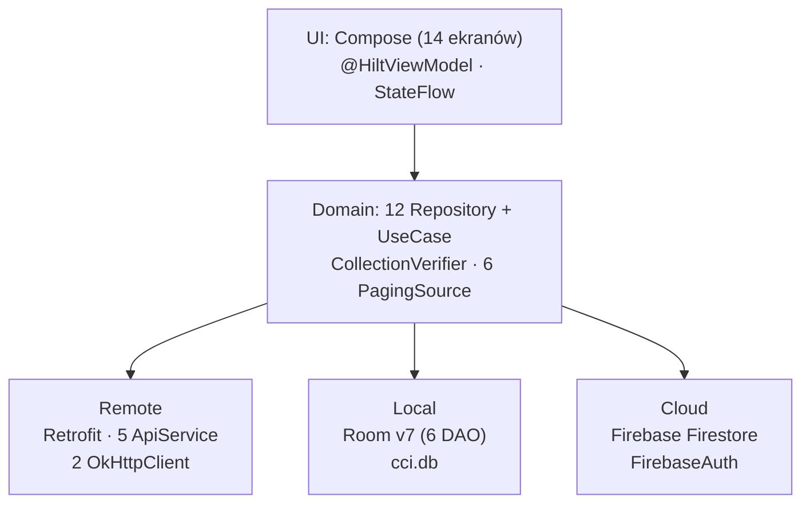

# Repo Map — cci-android

## 1. TL;DR

CCI Android to prywatna aplikacja dla jednego kolekcjonera kapsli. Pozwala sprawdzić w katalogu `crowncaps.info`, czy ma się już dany kapsel, i zarządzać jego fizyczną lokalizacją w klaserach — lokalnie w Room, synchronizowanych z Firestore. Projekt powstał w ciągu 5 dni przez jednego dewelopera wspomaganego AI; bus factor wynosi 1. Praca koncentruje się w warstwie `data/` (106 dotknięć plików) i w `ui/catalog/caps/detail/` (44), daleko od stabilnych peryferiów: `model/`, `ui/theme/`, `navigation/`. Największe miejsca bólu to auth (8+ iteracji) i `FirestoreRestoreUseCase` (operacja destruktywna wywoływana z dwóch miejsc). Nie ma grafu zależności dla warstwy Firestore — powiązania z tą warstwą bazują wyłącznie na analizie co-change z git, nie na statycznej analizie importów.

---

## 2. Teren

### Duże odpowiedzialności — tu żyje system

| Obszar | Dotknięcia (git) | Charakter |
|--------|-----------------|-----------|
| `data/` łącznie | 106 | Auth, paginacja, Firestore sync, Room, weryfikacja kolekcji |
| `ui/catalog/caps/detail/` | 44 | Najczęściej otwierany terminal nawigacji; 13 commitów na `CapDetailScreen.kt` |
| `model/` | 37 | Modele domenowe — zdrowe, ale każda edycja `CapExtended.kt` to fan-out ×11 |
| `ui/home/` | 26 | HomeScreen.kt — 17 commitów, hub menu i szybkiego wyszukiwania |
| `ui/catalog/caps/advanced/` | 17 | Wyszukiwanie zaawansowane — najgorętszy dzień (2026-06-12, 15+ commitów) |

### Peryferia — napisane raz, nieruszone

`ui/theme/` · `navigation/Screen.kt` (14 tras, stabilne po home-screen-redesign) · `di/FirestoreModule.kt` · `di/DatabaseModule.kt` · 5 API serwisów Retrofit · modele domenowe (poza `CapExtended`).

### Aktywność w czasie — jak powstawał projekt

| Dzień | Dominujący obszar | Co się działo |
|-------|-------------------|---------------|
| 2026-06-11 | `data/datasource`, `ui/home` | 5 funkcji równolegle: auth, Room v1, Firestore, redesign home, bindery |
| 2026-06-12 | `data/AdvancedSearchPagingSource`, `ui/catalog` | Sprint wyszukiwania — najgorętszy dzień (15+ commitów) |
| 2026-06-13 | `data/datasource`, `ui/home` | Firebase anon→email, bugfixing |
| 2026-06-14 | `data/datasource`, `ui/statistics` | Resilience, snapshot kolekcji, Room v3→v6, statystyki |
| 2026-06-15 | testy, CI/CD, infra | 7 schematów Room, Sentry, GitHub Actions, archiwizacja |

Projekt to rapid build, nie legacy — każdy plik ma historię liczącą dni, nie lata. Widok historii jest pełny dla okresu 5 dni; tego co było wcześniej nie ma, bo nie istniało.

---

## 3. Realne powiązania

### Skąd wiem — metoda i pokrycie

- **Git co-change** (analiza `git log --name-only`, 139 commitów): pokrywa wszystkie pliki we wszystkich warstwach. To jedyna metoda, która objęła warstwę Firestore.
- **Graf importów** (`dependency-analysis-gradle-plugin` 3.15.0): pokrywa zależności Maven/Gradle (`build.gradle`), nie graf importów między plikami Kotlin. Nie wskazuje, które `*.kt` importuje który inny `*.kt`.
- **Warstwa Firestore / Firebase:** brak grafu zależności między klasami. Powiązania w tej warstwie są `unknown` z perspektywy statycznej analizy — to co wiemy pochodzi wyłącznie z git.

### Najsilniejsze sprzężenia (co-change z git)

| Para / trójka | Wspólne commity | Interpretacja |
|---------------|----------------|---------------|
| `data/datasource` + `ui/catalog` | **15** | Zmiana kontraktu API propaguje bez buforu przez obie warstwy |
| `data/CapsRepository` + `ui/catalog` | **12** | CapsRepository to jedyny hub PagingSource — każda nowa lista ekranu wchodzi przez niego |
| `data/CapsRepository` + `data/datasource` + `ui/catalog` | **8** (trójka) | Pełny ripple: endpoint → PagingSource → ekran, wszystkie 3 naraz |
| `MainActivity` + `navigation/Screen` | **9** | Nawigacja jest za mocno sklejona z Activity hostem |
| `data/datasource` + `di/NetworkModule` | **7** | Nowy endpoint lub interceptor = zmiany w obu miejscach jednocześnie |
| `data/FirestoreRestoreUseCase` + `data/datasource` | **7** | Restore czyta/pisze przez DAO — każdy schemat Room pociąga restore |

### Specjalny przypadek: `model/CapExtended.kt`

Zmieniony tylko **5 razy**, ale z fan-out **11.4 unikalnych obszarów per commit** (najwyższy w projekcie — dane z git). Każda edycja oznacza kaskadę w: `CapDetailScreen`, `CapDetailViewModel`, PagingSource, `CapCacheRepository`, `CollectionVerifier`, widokach `statistics/`, `binders/` i innych. To sprzężenie strukturalne przez model domenowy, nie przez bezpośredni import — zmiana pola `@Serializable` propaguje do API, Room cache i UI jednocześnie.

### Sprzężenia przez regenerację (tańsze)

Room schema JSON (`app/schemas/v*.json`) zmienia się razem z `CciDatabase.kt`, ale **przez eksport (`exportSchema = true`)** — nie przez ręczną edycję. Koszt zmiany schematu = jeden bump wersji + migracja SQL; JSON generuje się sam. Nie traktuj tych plików jako osobnej zmiany do zarządzania.

### Brak cykli w DI

Graf jest acykliczny: `Composable → ViewModel → Repository → DataSource`. Jedyne sprzężenia wsteczne to field injection w `CCIApplication` (`@Inject lateinit`) — nie są cyklami Hilt.

---

## 4. Strefy ryzyka

**1. `data/AuthRepository.kt` — 8+ iteracji na jednym pliku**
Trzy ortogonalne mechanizmy w jednym miejscu: Laravel Sanctum (cookie + CSRF), Firebase email auth, Bearer token przez `SessionRepository`. Każde z nich iterowało niezależnie. Logika nie podzieliła się na mniejsze klasy — cała złożoność siedzi razem.

**2. `data/FirestoreRestoreUseCase.kt` — destruktywna operacja z dwóch miejsc**
`restoreFromFirestore()` robi `deleteAll()` i kaskadowo usuwa całą kolekcję Room, a potem ją odtwarza z Firestore. Jest wywoływana z `CCIApplication.onCreate()` AND z `AuthRepository.login()`. Mutex chroni przed TOCTOU, ale sam fakt dwóch wywołań oznacza, że każda zmiana flow logowania lub startu aplikacji może naruszyć gwarancję bezpieczeństwa restorecji.

**3. `model/CapExtended.kt` — niewidoczny fan-out**
Plik rzadko edytowany, ale każda edycja kaskaduje przez 11+ obszarów (patrz sekcja 3). Nie ma testu, który by to wychwycił automatycznie — brak unit testu dla fan-out modelu domenowego.

**4. `di/DatabaseModule.kt` + `data/datasource/local/CciDatabase.kt` — `fallbackToDestructiveMigration`**
Brakująca migracja = utrata całej lokalnej bazy. Flaga jest bezpieczna tylko dopóki `FirestoreRestoreUseCase` działa poprawnie. To sprzężenie między dwoma odległymi plikami: Firestore restore jest implicite wymaganiem dla bezpieczeństwa każdego bump wersji Room.

**5. Kontrakt API `crowncaps.info` — wiedza tacit bez spec**
Kontrakt odkrywany empirycznie (liczne fix-commity: `productId=1` nie `product_id=2`, `user-locale=pl`, redirect 302 jako sukces, obejścia client-side dla `in_collection`). Brak OpenAPI spec ani dokumentacji. Zmiana serwera jest niewidoczna przed deploy.

**6. Bus factor 1 — cała wiedza tacit u jednej osoby**
Żaden obszar nie ma pokrycia >1 człowieka. Szczególnie krytyczne: auth (obszar 1) i API contract (obszar 5) — wymagają wiedzy której nie ma w kodzie, tylko w pamięci autora i historii commitów.

---

## 5. Kogo zapytać

Projekt ma jednego kontrybutora ludzkiego. We wszystkich strefach ryzyka jedynym źródłem wiedzy jest **Sroki** (`sroki21@gmail.com`).

| Strefa | Temat do zapytania |
|--------|--------------------|
| Auth / NetworkModule | Powód `followRedirects = false`, ewolucja Firebase anon→email, szczegóły CSRF z Laravel Sanctum |
| FirestoreRestoreUseCase | Skąd TOCTOU, kontrakt danych Firestore (binder → binderPage → capPosition), dlaczego dwa miejsca wywołania |
| API crowncaps.info | Które endpointy ignorują `productId`, gdzie są obejścia client-side i dlaczego |
| CciDatabase migracje | Pułapki UNIQUE constraint przy `insertOrIgnore`, zależność `fallbackToDestructiveMigration` od Firestore |
| `CapExtended.kt` | Które z 23 pól są `@Serializable` do API, które UI-only, które trafiają do `cap_cache` |

---

## 6. Pierwszy dzień — od czego zacząć

Uporządkowane od szerokiego obrazu do szczegółu:

1. **`CCIApplication.kt`** — startup sequence w 5 krokach (Sentry → Firebase → uid → dedup → restore); tu widać, które singletony muszą być gotowe przed czym.

2. **`navigation/Screen.kt`** — 14 tras z parametrami; czytaj razem z diagramem nawigacji z artykułu struktury. Zrozumiesz co jest osiągalne skąd i jak wyglądają kontrakty URL.

3. **`di/NetworkModule.kt`** — dwa klienty OkHttp (dlaczego?), kolejność interceptorów, `productId=1` jako ukryte zachowanie sieciowe, `user-locale=pl`. Bez tego nie zrozumiesz, dlaczego niektóre requesty zachowują się inaczej.

4. **`data/AuthRepository.kt`** + `data/SessionRepository.kt` — pełny flow auth: CSRF → cookie → Bearer → Firebase. Czytaj razem, żeby śledzić gdzie token żyje między sesjami.

5. **`data/FirestoreRestoreUseCase.kt`** — jedyna destruktywna operacja w systemie. Przeczytaj przed jakąkolwiek zmianą w Room lub Firestore serwisach.

6. **`data/CapsRepository.kt`** — hub paginacji: tworzy 6 PagingSource, wstrzykuje `CapApiService` i `CapCacheDao`. Zrozum zanim dodasz nowy widok katalogowy.

7. **`data/datasource/local/CciDatabase.kt`** + `app/schemas/` — schemat v7 i lista migracji 1→7. Obowiązkowe przed każdą zmianą encji Room.

8. **`model/CapExtended.kt`** — 23 pola, `@Serializable`, zagnieżdżone obiekty. Przeczytaj zanim edytujesz model; następnie grep po `CapExtended` w projekcie, żeby zobaczyć realny zakres zmiany.

---

## 7. Ograniczenia

**Okno czasowe:** 5 dni (2026-06-11 – 2026-06-15). Projekt nowy — historia jest krótka, nie ma sensu mówić o "tendencjach długoterminowych". Wnioski o sprzężeniach są oparte na 139 commitach, nie na latach.

**Metoda:** Co-change z git wskazuje, co zmieniało się razem — nie dlaczego, i nie czy to dobry projekt. Silne sprzężenie par może być właściwe (auth + network są naprawdę powiązane) lub przypadkowe (ten sam commit naprawiał dwa niezwiązane błędy).

**Brak grafu importów między klasami Kotlin:** `dependency-analysis-gradle-plugin` analizuje zależności Maven, nie importy między plikami `.kt`. Nie wiemy z narzędzi, który ViewModel importuje który Repository — to wnioskowane z CLAUDE.md i z czytania kodu. Warstwa Firestore jest `unknown` dla statycznej analizy.

**Czego mapa NIE mówi:**
- Jakości kodu wewnątrz plików (mapa aktywności, nie review)
- Czy sprzężenie jest architektonicznie poprawne, czy to dług techniczny
- Co zmieni się w przyszłości — priorytety roadmapy są w `context/foundation/roadmap.md`
- Stanu runtime (crashe, wydajność, czasy ładowania) — to Sentry i profiler
